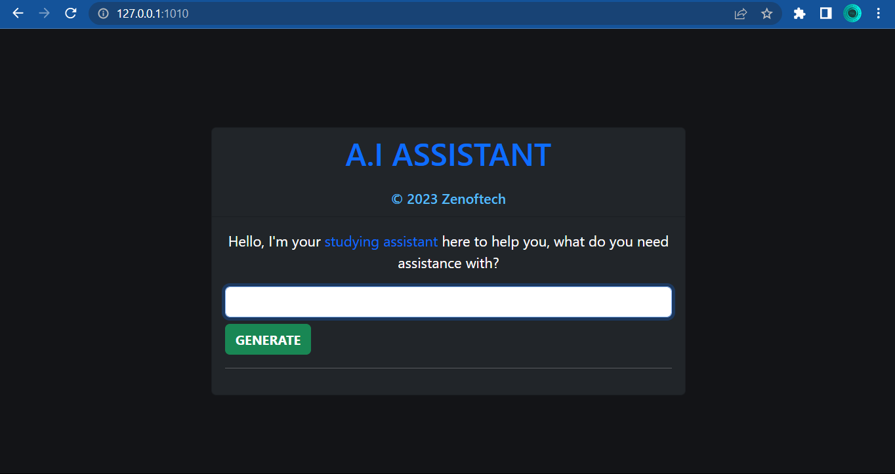
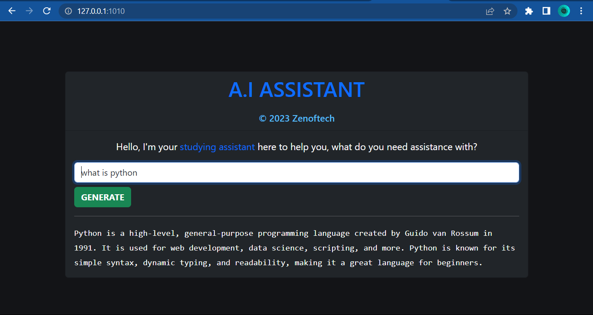

<h1 align="center">  A.I Assistant </h1>

<p align="center">


</p>

### Hey! this is your studying `artificial intelligent assistant`. It is built to help you when you have problems whilst studying.

# How to use it as a developer.

### Clone the repo.

```bash
git clone https://github.com/zenoftech/aiAssistant.git
```
```bash
cd aiAssistant
```

 1. Firstly, you need need an API key to enable the OpenAI model to perform `study assistant` tasks for us. To get the API key, you first have to create an account on the official website of <a href="https://platform.openai.com/docs/api-reference/introduction"> OpenAI</a>. Once you have completed the signup process, go to the OpenAI API reference where you will be directed to a page to generate your API key.

 2. Make sure you keep the API key safe. Create a file in your app-level folder and call it `secret_key.py`.


```
pip install -r requirements.txt
```
```
python manage.py runserver
```

Finally go to this address http://127.0.0.1:8000

## Feel free to contribute 👨‍💻👨‍💻

## Support

💖 If you like this project, give it a ⭐ and share it with friends!

<p align="center">
<a href="https://ko-fi.com/zenoftech"> </a>
</p>
  